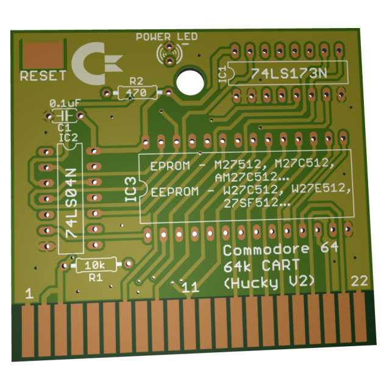
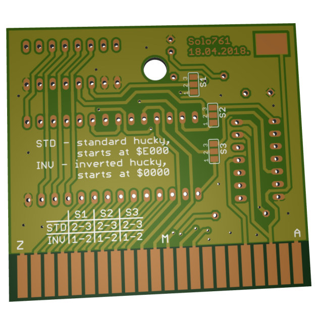
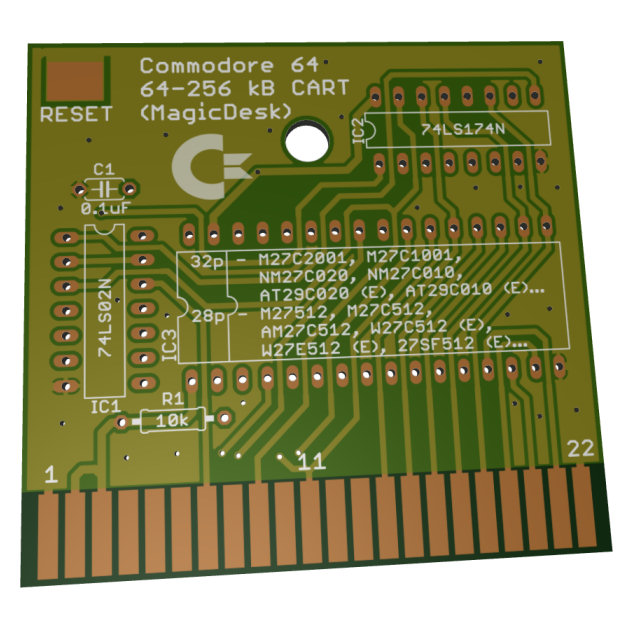
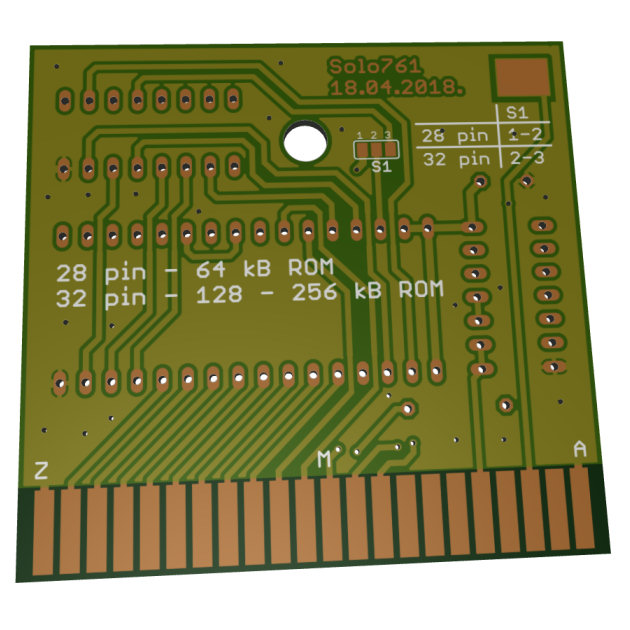

# C64 Cartridge Creator tool

This is small utility written in Java (1.8) for converting C64 prg files to BIN files for burning to (E)EPROM chips, of up to 64 kB.

## More info

You can choose from three types of cartidges, *Magic Desk*, *Hucky* and *Inverted Hucky*. You can also choose between two types of C64 loaders for these files. First one is loader from Frank Buß' prg2crt python script that can be found [here](http://www.frank-buss.de/c64/prg2crt/index.html), used here with his permission, and the other is loader from C64 tool 152blks.prg that can be used on real C64 (or emulator like Vice) to convert prg files from PRG to *Hucky* type bin files. Now it can be used to also make *Magic Desk* and *Inverted Hucky* type bin files.

From what I've tested both loaders work fine, main difference is that prg2crt loader takes less space, but it doesn't "hide" loading and processing from the screen. 152blks loader uses more space for itself, but it blacks the screen so while it loads from the cartridge you don't see anything happening. So to each to his own.

Beside bin files it can also create CRT for use (or testing) with emulators. With exception of *Hucky* cartridges which aren't supported in CRT file format (at least yet). If you choose combination of Hucky and CRT files tool will warn you about this and ask if you want to abort or continue to create *Inverted Hucky* (also called *RGCD*) CRT instead. 
Basically, difference between *Hucky* and *Inverted Hucky* is order of memory banks, everything else is the same.

## GUI Usage

Basically just start jar file. Either from command line

`java -jar cartCreator.jar`

or just double click jar file from windows, on my PC (Win 10) it automatically starts the tool.

Tool should also work on other OS' that have Java, I tried to avoid OS specific stuff in the code.

## Command Line usage

Tool also supports command line usage, enter 

`java -jar cartCreator.jar -h`

in command line to see help

- Parameters:
	-  **-i \<input file\>** -prg file to convert`
	-  **-t \<cartidge type\>**	- which cartridge type to convert to
		- Cartridge types:
			- **h** - Hucky 64kB
			- **ih** - inverted Hucky 64kB
			- **md** - MagicDesk 64kB
	- **-l \<loader type\>** - which loader to use
		 - Loader types:
			- **a** - prg2crt loader from Frank Buß' python script
			- **b** - 152Blks loader

- Semioptional (you need at least one of them):
	- **-c** - convert to emulation cartridge format (CRT)
	- **-b** - convert to bin file for burning to (E)EPROM

- Optional:
	 - **-o \<output file\>** - output file to save converted file to, if it differs from input file
	- **-h** - 				help`

Order of parameters is not important.

For example:

Convert prg to inverted hucky bin file using "a" variant loader

`java -jar cartConv.jar -i BubbleBobble.prg -t ih -b -l a`

Convert prg to MagicDesk CRT file for use in emulator (e.g. Vice) and bin file using "b" variant loader

`java -jar cartConv.jar -i BubbleBobble.prg -o BubbleBobbleEmu.crt -t md -l b -c -b`

## Additional stuff

In folder *EagleSchematics* are two PCB schematics and designs that can be opened with Eagle PCB, one for MagicDesk compatible cartridge and the other for Hucky/Inverted Hucky cartridge (how you solder three bridges on PCB selects if it's going to work as Inverted Hucky or normal Hucky board.

There are also gerber files for both of them if you want to order them from some PCB manufacturer. If they don't require some special settings these should do, if not you can load schematics/design files to Eagle and make gerber files with their settings.

So far they're untested, I've made one Hucky board DIY with above schematics and it works. I also have both boards made from above gerber files, but so far haven't tried them, I've been busy making this tool :).

MagicDesk board should support up to **256 kB (E)EPROM chips**, but can create only up to 64 kB images. Or more simply said, it needs to fit in C64 RAM, basically any game that could be ran from the tape. 
While it could create BIN/CRT files from bigger PRG files they wouldn't be able to start as they wouldn't fit in C64 RAM.
But you can use [Magic Desk Compatible Cartridge Generator tool](http://csdb.dk/release/?id=132937) from C64 Scene Database to create multi game/application cartridges to fill those 256 kB. My goal for this was to make one cartridge - one game so I didn't dig deeper into it.

**Hucky/Iverted Hucky** 

**MagicDesk**

